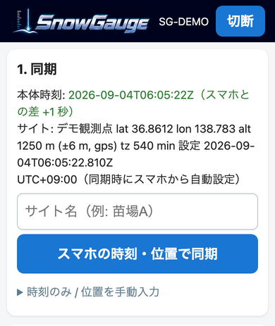
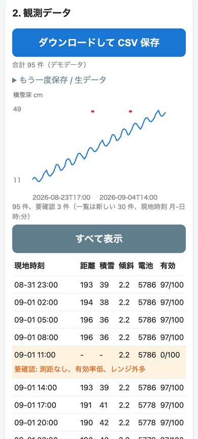
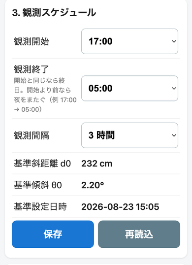
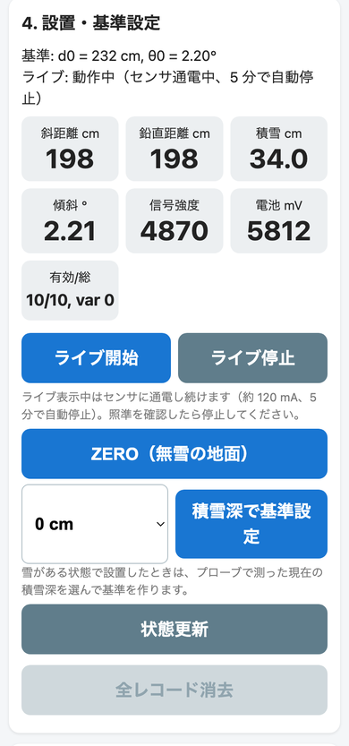

  <picture>
    <source media="(prefers-color-scheme: dark)" srcset="docs/assets/logo/logo_dark_800.png">
    
  </picture>

# SnowGauge

山岳・亜高山帯の無人サイトで 2 年間動く、低価格・低消費電力の積雪深ロガーです。
近赤外レーザー測距（TFmini Plus）で雪面までの斜距離を測り、IMU の傾斜で補正して積雪深に換算します。
スマホ（Android Chrome）の Web Bluetooth ページで時刻合わせ・データ回収・設定を行い、電池だけで越冬します。

*SnowGauge is a low-cost, low-power snow-depth logger (NIR laser ToF + XIAO nRF52840 Sense, Zephyr firmware, Web Bluetooth field app). Documentation is in Japanese; the developer docs (`firmware/README.md`, `docs/app/README.md`, `docs/record_format.md`) are in English.*

## はじめての方へ（この順に読む）

| 段階 | 読むもの | 内容 |
|---|---|---|
| 1. 部品を買う | [docs/01_parts.md](docs/01_parts.md)（[CSV](docs/01_parts.csv)） | 購入リスト。基板版・ブレッドボード版・TSD20 版の差分 |
| 2. 組み立てる | [docs/02_assembly.md](docs/02_assembly.md) | ブレッドボード（[配線ガイド](https://0kam.github.io/SnowGauge/breadboard_guide.html)）／基板 v1.2／筐体（検討中） |
| 3. ファームを書く | [docs/03_firmware.md](docs/03_firmware.md) | [Release](https://github.com/0kam/SnowGauge/releases) からダウンロードして USB で書き込み |
| 4. アプリを入れる・使う | [docs/04_app.md](docs/04_app.md) | **アプリ: https://0kam.github.io/SnowGauge/app/** 設置時・巡回時の手順 |
| 5. データを見る | [docs/05_data.md](docs/05_data.md) | CSV の列、品質フラグ、積雪深の再計算 |

文書一覧と「どこを直すとき何を更新するか」は [docs/README.md](docs/README.md) にあります。

## 現地アプリ

スマホの Chrome で https://0kam.github.io/SnowGauge/app/ を開き「ホーム画面に追加」すると、圏外でも起動するアプリになります（[使い方](docs/04_app.md)）。本体なしで画面を試すには [デモ表示](https://0kam.github.io/SnowGauge/app/?demo=1)。

<table align="center"><tr>
  <td valign="top" width="25%"></td>
  <td valign="top" width="25%"></td>
  <td valign="top" width="25%"></td>
  <td valign="top" width="25%"></td>
</tr><tr>
  <td align="center">1. 同期</td><td align="center">2. 観測データ</td><td align="center">3. スケジュール</td><td align="center">4. 設置・基準設定</td>
</tr></table>

## 主な仕様

- 測距: TFmini Plus（近赤外 ToF）。安価な代替として TSD20 版を A/B 比較予定
- MCU: Seeed XIAO nRF52840 Sense（BLE、IMU 内蔵）、Zephyr（nRF Connect SDK v3.4.0）
- 電源: リチウム単 3（Energizer L91）×4。実測スリープ 26 µA（BLE アドバタイズ込み）、測定 1 回 0.037 mAh
- 記録: 40 バイト/回、QSPI フラッシュ上の LittleFS ＋ 内蔵フラッシュへのミラー。8 回/日で 2 年以上
- 通信: BLE（アドバタイズに電池・件数・最終値、SMP でファイル取得と時刻同期、キャリブレーション用 GATT）
- 現地 UI: Web Bluetooth ページ（PWA、オフライン動作、手袋前提の大きなボタン）

## 開発者向け

- 設計仕様書（要件・設計判断・改版履歴）: [SnowGauge_設計仕様書_v0.12.md](SnowGauge_設計仕様書_v0.12.md)
- 基板（KiCad、ガーバー、ピンマップの正）: [pcb/README.md](pcb/README.md)
- ファームウェアのビルド・シェル: [firmware/README.md](firmware/README.md)
- アプリの構成（SMP クライアントの流用方法）: [docs/app/README.md](docs/app/README.md)
- レコード形式・CSV 列定義: [docs/record_format.md](docs/record_format.md)
- 作業引き継ぎ（AI エージェント向け）: [CLAUDE.md](CLAUDE.md)

## 状態（2026-09-04）

基板 v1.2 発注済み（到着 9/10 ごろ）。ブレッドボードでファームウェア（ステップ 1〜4）とアプリの実機確認まで完了。次は基板到着後の再測定、TSD20 版ファームウェア、筐体。
