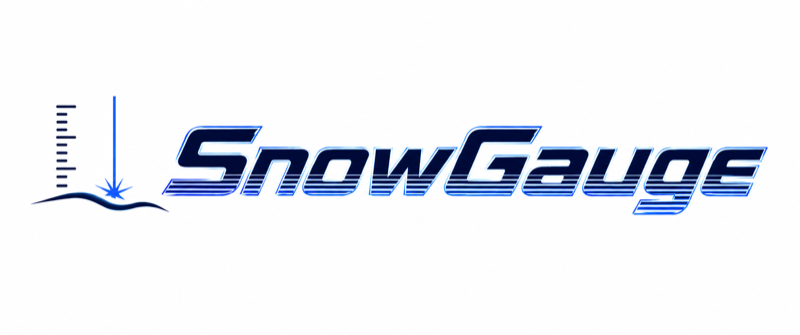

  <picture>
    <source media="(prefers-color-scheme: dark)" srcset="docs/assets/logo/logo_dark_800.png">
    
  </picture>

# SnowGauge

An inexpensive, low-power snow depth logger for remote subalpine sites, designed for multi-point deployment.

- **Method**: Near-infrared laser ToF ranging (850–905 nm) aimed obliquely at the snow surface, with IMU-based tilt correction
- **MCU**: Seeed XIAO nRF52840 Sense (built-in IMU, temperature, RTC, BLE, 2MB QSPI flash)
- **LiDAR**: PONO TSD20 (low-cost, 3.3V) / Benewake TFmini Plus (IP65, signal strength output) — A/B comparison in the 2026-27 winter field trial
- **Power**: 4× Energizer L91 AA lithium cells, targeting **2 years maintenance-free** (typ. ~85 µA average)

## Documentation

The single source of truth is the design specification (Japanese):

- [SnowGauge_設計仕様書_v0.11.md](SnowGauge_設計仕様書_v0.11.md)
- [Assembly manual (TFmini Plus variant)](docs/assembly_tfmini_plus.md)

## Status

PCB v1.2 ordered (JLCPCB); breadboard development environment ready. Firmware development starting. Firmware and enclosure development in progress toward the 2026-27 winter comparison trial.
