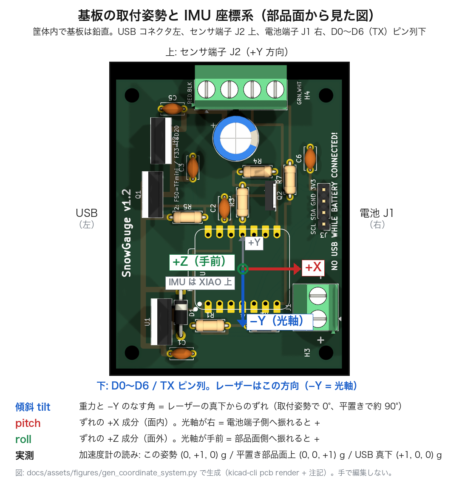

# 座標系と傾斜の定義（基板の取付姿勢、IMU 軸、tilt / pitch / roll）

2026-09-11 に取付姿勢を 180° 回して「USB 左・センサ端子 J2 上」にしました（それ以前は USB 右・J2 下）。
光軸は IMU の **−Y** です。この文書が傾斜まわりの定義の正です。他の文書はここへリンクします。

（図: `docs/assets/figures/gen_coordinate_system.py` で生成。`kicad-cli pcb render` の上面図を反時計回りに 90° 回し、軸と文字を描き足したもの。基板や取付姿勢を変えたら再実行する。手で編集しない）

## 1. 取付姿勢

筐体の中で PCB v1.2 は**鉛直**に立てます。部品面から見て:

| 辺 | あるもの |
|---|---|
| 上 | センサ端子 J2（TFmini / TSD20）。センサのケーブルは筐体内を上へ回して J2 に入れる |
| 左 | XIAO の USB コネクタ |
| 下 | XIAO の D0〜D6（TX）ピン列、リセットボタン側。**レーザーはこの向き（真下）に出る** |
| 右 | 電池端子 J1 |

これは `pcb/README.md` の基板上面図（USB が上辺）を**反時計回りに 90°** 回した向きです。
センサ本体は筐体の外に真下向きで固定します。基板のどの辺に J2 があるかとレーザーの向きは無関係で、
傾斜の基準になるのは「基板に対してセンサがどちらを向いているか」です。

## 2. IMU の座標系（XIAO nRF52840 Sense の LSM6DS3TR-C）

取付姿勢で見たときの軸の向き（2026-09-07 に 3 姿勢で実測、2026-09-11 の姿勢変更で符号を付け替え）:

| 軸 | 向き | 根拠となる読み |
|---|---|---|
| **−Y** | **下 = レーザー光軸** | 取付姿勢で a = (0, +1, 0) g |
| +X | 右（電池端子側、USB と反対） | USB を真下にすると a = (+1, 0, 0) g |
| +Z | 手前（部品面側の法線） | 平置き部品面上で a = (0, 0, +1) g |

加速度計は静止時に**上を向いた軸に +1 g** を出します（重力の反作用）。したがって「−Y が下向き」は「ay = +1 g」として観測されます。ファームウェアの符号はこれに合わせてあります（`firmware/src/tilt_lsm6dsl.c`）。
この姿勢では +X 右・+Y 上・+Z 手前で、図の見た目どおりの右手系になります。

## 3. 傾斜量の定義（レコードとアプリで使う値）

すべて 0.01° 単位の符号付き 16 bit でレコードに入ります（[record_format.md](record_format.md)）。

| 値 | 定義 | 取付姿勢での目安 |
|---|---|---|
| `tilt` | 重力方向と光軸（−Y）のなす角。**レーザーの真下からのずれ** | 0°（傾けた分だけ増える。平置きでは約 90°） |
| `pitch` | ずれの **+X 成分**（基板面内）。光軸が右 = 電池端子側へ振れると + | 0° |
| `roll` | ずれの **+Z 成分**（基板面外）。光軸が手前 = 部品面側へ振れると + | 0° |

計算: `tilt = acos(ay / |a|)`、`pitch = atan2(ax, ay)`、`roll = atan2(az, ay)`。

積雪深の式で使うのは `tilt` だけです: `積雪深 = (d0 − d) × cos(tilt)`（仕様書 §4.5）。`pitch` / `roll` は「どちらへ傾いたか」を知るためのもので、設置時の照準調整と、設置後にポールが動いたときの向きの判定に使います。

## 4. 現地で見えるもの

- アプリのライブ表示「傾斜 °」= `tilt`。斜め照準（θ = 20〜30°）なら 20〜30 が出ているのが正常。
- シェル `tilt` は `tilt=… from nadir (axis -Y)  pitch=… (toward +X)  roll=… (toward +Z)  a=(ax,ay,az) mg` を出す。`a` の読みが §2 の表と合っていれば軸の解釈は正しい（取付姿勢で ay ≒ +1000 mg）。
- 基準傾斜 θ0（ZERO を取ったときの `tilt`）は設定に保存され、アプリで表示のみ。

## 5. ベンチ（平置きのブレッドボード）での注意

既定ビルドは鉛直取付用なので、平置きでは `tilt` が約 90° と出ます。平置きで 0° を出したいときは `overlay-flat.conf` を付けてビルドします（光軸 = ±Z、どちらの面が上でも可）。ビルドオプションは Kconfig の `SNOWGAUGE_SENSOR_AXIS`（`firmware/README.md`）。

基板を上下逆さ（USB 右・J2 下）に立てると `tilt` は 180° と出ます。0° に近い値が出ない、
あるいは ay が −1000 mg 付近なら取付の向きが逆です。

## 6. 以前のファームウェアとの違い

| | 2026-09-07 より前 | 2026-09-07〜09-11 | 以後（既定） |
|---|---|---|---|
| 取付姿勢 | 平置き | 鉛直・USB 右・J2 下 | 鉛直・USB 左・J2 上 |
| 光軸 | 基板法線（±Z） | +Y | **−Y** |
| `tilt` | 重力と法線のなす角 | 重力と +Y のなす角 | 重力と −Y のなす角 |
| `pitch` | X 軸の水平面からの角度 | ずれの +X 成分 | ずれの +X 成分（同じ） |
| `roll` | Y 軸の水平面からの角度 | ずれの +Z 成分 | ずれの +Z 成分（同じ） |
| Kconfig | `..._AXIS_Z` | `..._AXIS_POS_Y` | `..._AXIS_NEG_Y` |

`pitch` / `roll` の定義（面内 +X 成分・面外 +Z 成分）は変わっていません。姿勢が 180° 回った分、
同じ符号が指す**現場での向き**が左右反転します（+X は電池端子側のままですが、それが左から右になります）。
古いファームウェアで取ったレコード（試験データのみ。展開機はすべて新定義）は旧定義の値です。
レコード形式（version 1）は変えていないので、どちらの定義で取られたかはファームウェアの日付で判断します。
